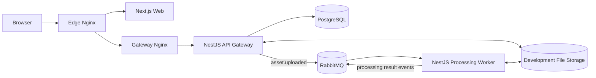

# NestFlux Architecture

## Purpose

NestFlux is a distributed file-ingestion and image-processing platform. It
accepts image uploads through an authenticated HTTP API and processes those
images asynchronously through RabbitMQ workers.

The source code is stored in one pnpm monorepo, but each application runs as an
independent process and container.

## System context

## Architectural style

NestFlux uses independently executable services connected through HTTP and
asynchronous messages:

- The web application communicates with the API Gateway through HTTP.
- The API Gateway publishes processing jobs to RabbitMQ.
- Processing workers consume jobs without accepting public HTTP traffic.
- Workers publish result events instead of directly calling Gateway functions.
- The API Gateway owns authentication and asset database records.
- PostgreSQL and RabbitMQ are infrastructure components, not business
  microservices.

## Service boundaries

### Next.js web application

The web application owns the browser user interface. It presents registration,
sign-in, upload, and asset-status screens. It does not connect directly to
PostgreSQL, RabbitMQ, or the processing worker. All business requests go through
the API Gateway.

### NestJS API Gateway

The API Gateway owns the public HTTP API, request validation, authentication,
authorization, upload admission, and asset lifecycle records. It stores an
asset record before publishing an `asset.uploaded` event. It also consumes
processing result events and updates the corresponding asset record.

### NestJS processing worker

The processing worker is a headless RabbitMQ consumer. It reads an uploaded
file, creates image variants, and publishes success or failure events. It does
not expose a public HTTP port and does not call functions inside the Gateway.

## Infrastructure responsibilities

- Edge Nginx is the public entry point. It routes page requests to the web
  application and `/api` requests to the Gateway load balancer.
- Gateway Nginx distributes API requests across Gateway replicas.
- RabbitMQ transports processing jobs and result events between services.
- PostgreSQL stores Better Auth and asset lifecycle records owned by the API
  Gateway.
- A shared Docker volume stores files during local development.

## Messaging contracts

The first processing workflow uses these logical events:

1. `asset.uploaded` tells a worker that a new asset is ready for processing.
2. `asset.processing.started` reports that a worker accepted the job.
3. `asset.processing.completed` reports generated output locations.
4. `asset.processing.failed` reports a safe error description.

Message payload types will live in `packages/contracts`. Applications may share
these contracts, but they must not import each other's controllers, services,
or business implementations.

## Data ownership

The API Gateway owns the authentication and asset tables. The worker reports
state changes through RabbitMQ instead of directly updating those tables. This
is an intentional improvement over the initial blueprint, which allowed both
backend applications to modify the same database records.

## File storage

For local development, the Gateway and worker share a Docker volume. This keeps
the learning environment self-contained on one Docker host. A production
deployment should replace that volume with durable object storage so replicas
can run on different hosts without relying on a shared local filesystem.

## Deployment rule

Every application under `apps/` must be independently buildable, testable,
startable, scalable, and containerized. Sharing a repository must not create a
runtime dependency between application processes.
